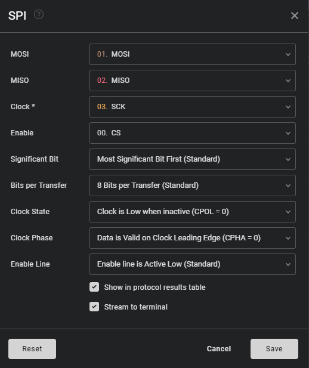
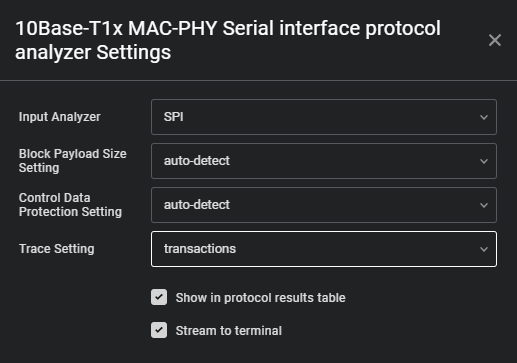

# 10Base-T1x MAC-PHY Serial Interface Protocol Analyzer

## Getting started

The 10Base-T1S analyzer decodes the traffic on the SPI bus between a host and 10Base-T1S MAC-PHY device, and visualizes the protocol details at various levels e.g. low level RX/TX or transaction.

The analyzer requires a valid capture of the SPI bus traffic as input (CLK, MISO, MOSI and CS signals). An example configuration for SPI capture is shown in the image below.

## Analyzer Settings

The analyzer has various settings to control the detail level of the decoding and automatic detection of protocol settings.

### Trace

Available analyzer trace ouputs:
- transactions: This analyzer will show transaction relevant data (excludes dummy bytes etc., decodes protected register writes)
- rx: Low level analyzer that shows host receive data including dummy bytes
- tx: Low level analyzer that shows host transmit data including dummy bytes

### Block Payload Size

Block payload size to decode data transactions.
- auto-detect: The analyzer will try to auto-detect the size by identifying writes to the configuration register CONFIG 0
- 64: Sets block payload size to 64 bytes
- 32: Sets block payload size to 32 bytes

Note that auto-detect only works if changes to the register containing these settings are captured so that the analyzer can extract them or if the default settings do not change. E.g. if the capture misses an update to the block payload size the decoding will not work correctly. In this case the user can manually set the block size.

### Control Data Read/Write Protection

This setting defines whether or not the protection for the control read/write data is enabled.
- auto-detect: The analyzer will try to auto-detect the setting by identifying writes to the configuration register CONFIG 0
- enabled: The analyzer assumes that control read/write data protection is enabled
- disabled: The analyzer assumes that control read/write data protection is disabled

Note that auto-detect only works if changes to the register containing these settings are captured so that the analyzer can extract them or if the default settings do not change e.g. if the capture is started after register configuration is finished and the settings are not the default the analyzer will be unable to detect the correct setting. In this case the user can manually configure the setting for the capture session. However, since the manual setting will be valid for the whole capture but if there is a mix of protected and unprotected control writes only a part of them will be decoded correctly.

## Limitations

When multiple registers are written in one transaction (auto address increment) only the first register will be checked for updates on the configuration settings.

## Changelog

### [1.0.0] - April 2025
- DSG-7698: Shorter extension name to match undocumented Saleae marketplace requirements

### [0.0.1] - January 2024

Initial release.
